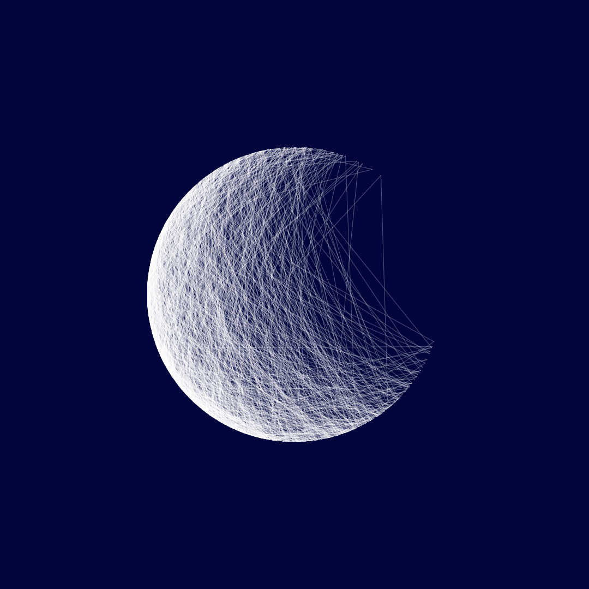

<h1 align="center">Andrea Diotallevi - Software Engineer</h1>

  
  
  

  

  

[Overview](#overview) | [Projects](#projects) | [Skills](#skills) | [Education](#education) | [Experience](#experience) | [Interests](#interests)

## Overview

I am a **full-stack software engineer**, with a passion for clean software architecture and digital transformation. I have expertise in designing, implementing, and maintaining full-stack applications with proficiency in Python, JavaScript, Node, PostgreSQL, React, Redux, Git, CI/CD, and RESTful APIs. I have also experience **collaborating** in modern software methodologies like test-driven development, pair programming and AGILE. Before becoming a software engineer, I worked as an architect for five years, where I learnt a great deal about attention to detail, team collaboration and developing technical documentation. Working with cloud and design technologies within the architectural industry is where I came to learn I had a much stronger affinity towards the software side of my work, where I was looking into ways to **automate** time-consuming tasks with code.

Ever since gaining exposure to programming, through practising with different [data structures and algorithms](https://www.codewars.com/users/AndreaDiotallevi) with Python, I became hooked into coding. I spoke to developers about the industry and started **self-learning** for about a year and a half before taking the leap and investing in my future with [Makers Academy](https://makers.tech/). During this course, I rapidly increased my skills as a developer using principles such as **TDD**, DRY, OOP, and XP values and got **hands-on experience** in building full-stack web applications, in a range of different technologies, including [Ruby](https://github.com/AndreaDiotallevi/expense-tracker) and [JavaScript](https://github.com/AndreaDiotallevi/the-movie-mapper).

The way technology is changing the world inspires me to learn and want to create **scalable solutions** to solve real-world problems, like accessibility and waste of resources. I love working with other bright, motivated engineers who share their passion and I am in constant search of something new to learn, like [web scraping](https://github.com/AndreaDiotallevi/movie-titles-scraper), [websockets](https://github.com/AndreaDiotallevi/radio-player) and writing [blog](https://www.andreadiotallevi.com/blog) posts on a technical subject. Having a **varied professional background** and interests, I hope to leverage the different experiences I have gained to support the development of my colleagues, the company and myself.

## Projects

| NAME | DESCRIPTION | INDUSTRY KNOWLEDGE | TECHNOLOGIES | TESTING / CI / CD|
| --- | --- | --- | --- | --- |
| 
[**THE MOVIE MAPPER**](https://github.com/AndreaDiotallevi/the-movie-mapper)
 | A React web application where you can click on any country, get the best movies from that country and filter them by genre (Group project of 2 weeks I extended afterwards) | Asynchronous APIs calls, asynchronous testing, global state management, API mocking, promises, async / await, web scraping, AWS deployment | React, Redux, JavaScript, Python, HTML/CSS | 
Jest, Enzyme, Circle CI, [**AWS**](https://www.themoviemapper.com/)   |
| 
[**ARCHQUERY**](https://github.com/AndreaDiotallevi/archquery)
 | A full-stack application that lets architects ask, respond and vote questions like software engineers do on Stack Overflow (Personal project of 1 month) | RESTful APIs, row SQL relational database, persistent authentication with passport.js, Redis session storage, CKEditor | Node, Express, PostgreSQL, Redis, React, Redux, HTML/CSS | 
Jest, Enzyme, Circle CI, [**Heroku**](http://www.archquery.com)   61% Coverage |
| 
[**ALBUMS MANAGER**](https://github.com/AndreaDiotallevi/albums-manager)
 | A full-stack web application built with the MERN stack and the LastFM API that lets a user add, view and loan his albums (Personal project of 1 week) | RESTful APIs, testing API endpoints with Supertest, connect front-end and back-end via proxy, axios module, URL query string | Node, Express, MongoDB, React, HTML/CSS | 
Jest, Enzyme, Circle CI, [**Heroku**](https://albums-manager.herokuapp.com)   94% Coverage |
| 
[**FACADE BROCHURE**](https://github.com/EManifold/acebook-zuckermen)
 | A full-stack web application where you can authenticate, create, edit, delete, like and comment posts, with custom fonts and colours (Group project of 2 weeks) | Model View Controller patterns, Object Relational Mapping database, JavaScript DOM manipulation | Ruby, Rails, ActiveRecord, JQuery, HTML/CSS | 
RSpec, Capybara, Travis CI, [**Heroku**](https://acebook-zuckerman.herokuapp.com/)  
 |
| 
[**EXPENSE TRACKER**](https://github.com/AndreaDiotallevi/expense-tracker)
 | A full-stack web application where you can manage shared expenses and view credit and debit balances for each member of a theme (Personal project of 2 weeks) | RESTful API, RESTful routes, relational database associations, authentication with BCrypt, time mocking | Ruby, Sinatra, ActiveRecord, HTML/CSS | 
RSpec, Capybara, Travis CI, [**Heroku**](https://expense-tracker-sinatra.herokuapp.com/)  
 |
| 
[**BANK**](https://github.com/AndreaDiotallevi/bank-python)
 | A console application that allows you to make deposits, withdrawals and print your current bank statement (Personal project of 1 week) | Object Oriented Programming class modelling, decoupled unit tests, class mocking, dependency injection | Python | 
PyTest, Travis CI   |

## Skills

#### Technical flexibility

I have trained at Makers Academy following **TDD** methodology, in addition to **Agile** and **XP values**. My adaptability developed through working in different industries, which translated into developing projects in a range of different technologies, including **Ruby**, **JavaScript** and **Python**. I have shown good practice when using TDD with an **external reviewer**, following a red-green-refactor cycle and making my code as clean and readable as possible.

#### Teamwork and collaboration

During my time as an architect, I learnt to collaborate with a range of different professionals, from the **client** and business side, to the **technical** and consultancy side, in order to **achieve common goals** and results. At makers, I have applied my teamwork abilities to understand different parts of the codebase to better recognise the roles and responsibilities of our team and allow better **delegation** of tasks.

#### Proactive mindset and resourcefulness

My enthusiasm for **learning** and developing **creative** solutions makes me extremely **determined** and proactive when facing a new challenge. During my final project at Makers, I developed an alternative idea for getting the best movies for each country with the use of web scraping technologies, which **solved the problem** of not being able to query any movie API by country.

#### Sustained focus and precision in reviewing technical documentation

I am able to stay focused for long hours and have the **patience** to **review** technical documentation. At my previous job, I was responsible for checking sub-contractors drawings and specifications of a multi-residential project at construction stage, and my overall **accuracy** assisted the main contractor with the delivery of a **quality** product.

## Education

**Makers Academy, London, UK** (October 2019 to January 2020)

16-week intensive full stack web development bootcamp focusing on:

- Promoting TDD, DRY, SRP, OOP, MVC, clean code, teamwork, pair programming, respect, mindfulness, and acceptance.
- Multiple group projects simulating real-world team environments with stand-ups, retros, sprint-planning, task-delegation, and thoughtful communication.
- Agile / XP.
- Ruby, Sinatra, Rails, JavaScript, JQuery.
- RSpec, Jasmine.

**Marche Polytechnic University, Ancona, Italy** (September 2008 to December 2014)

Master's degree in building engineering and architecture (110/110 with honors).

## Experience

**Proctor and Matthews Architects, London, UK** (March 2015 to September 2019)

_Project Architect_

- Technical design and development.
- Mark-up and check of technical information from the consultants.
- Project management and client meetings.
- Python scripts automating time-consuming tasks like renaming multiple files with correct revision numbers.

## Interests

#### Generative Art

I discovered the field of [generative art](https://github.com/AndreaDiotallevi/andreadiotalleviart) while learning to code on my own and became captivated by this, experimenting with p5.js and processing, and sharing my work on [openprocessing.org](https://www.openprocessing.org/user/157729).

#### Music

I have been playing the piano since the age of five, and music has always been integral to my life. The habit of practicing and composing pieces of music has taught me how to concentrate for long hours and build a balanced and grounded mindset. In June 2009 I received the piano diploma from the Conservatory of Ancona, Italy.

#### Chess

I enjoy playing chess and following tournaments on-line, as I am fascinated by the math and algorithms hidden within the rules of the game.

#### Sports

I am inspired by sport stories and people, from which I have learnt so much in terms of respect, self-esteem and personal development. My favourite sports to watch are rugby and tennis, while to practice are swimming and cycling.
